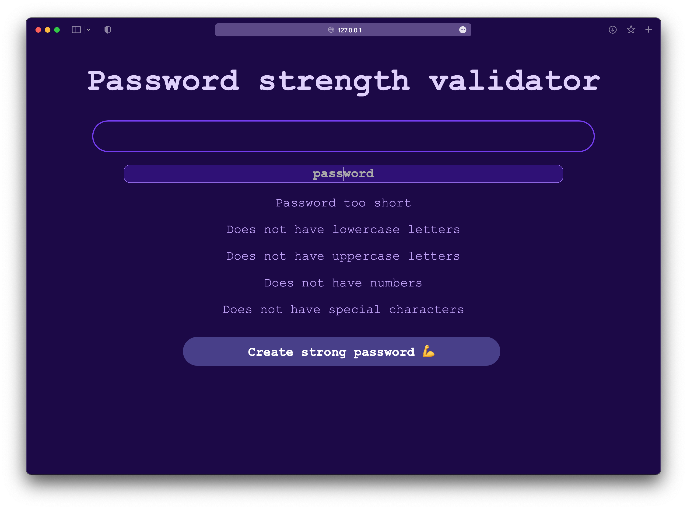
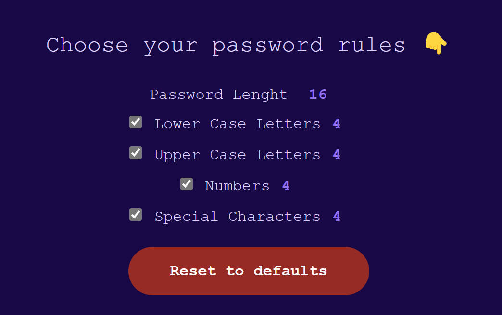

# Password Strength Validator

A password strength validator website that shows how secure is the typed password.



You can also create a new strong password 👇


And you can chose the rules to generate your password ❤️



🙈 No data is collected!

# Technologies

- [HTML](https://developer.mozilla.org/en-US/docs/Web/HTML)
- [CSS](https://developer.mozilla.org/en-US/docs/Web/CSS)
- [JavaScript](https://developer.mozilla.org/en-US/docs/Web/JavaScript)
- [Node](https://nodejs.org/en/docs/)

# Setup

## Clone repository

Create and go to the directory where you want to place the repository

```bash
  cd my-directory
```

Clone the project

```bash
  git clone https://github.com/pncsoares/password-strength-validator.git
```

Go to the project directory

```bash
  cd password-strength-validator
```

# License

MIT